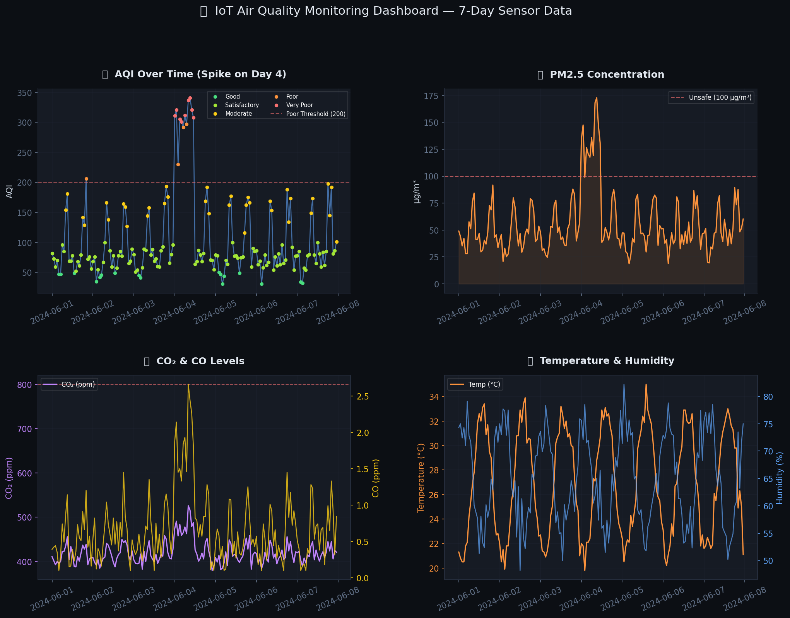
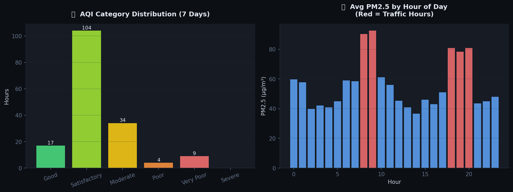
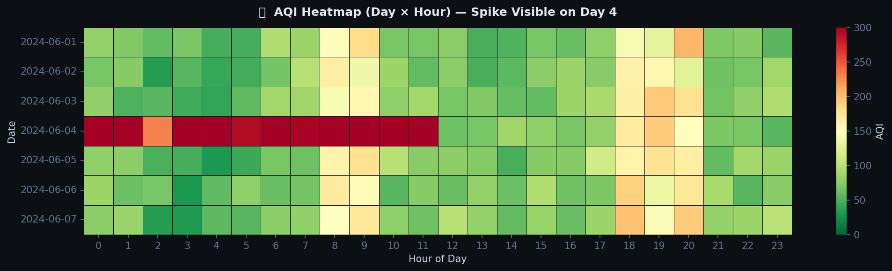

# 🌍 Air Quality Monitoring Dashboard

## 📌 Project Overview

This project simulates an Air Quality Monitoring System using Python and environmental sensor data.

The dashboard analyzes air pollution trends, AQI levels, PM2.5 concentration, CO₂ levels, temperature, and humidity while generating alerts for unsafe environmental conditions.

---

## 🚀 Features

* Air Quality Index (AQI) Monitoring
* PM2.5 Concentration Analysis
* CO₂ Level Monitoring
* CO Gas Monitoring
* Temperature Tracking
* Humidity Tracking
* Alert Detection System
* AQI Category Classification
* Pollution Heatmap Analysis
* Environmental Data Visualization

---

## 🛠 Technologies Used

* Python
* Pandas
* NumPy
* Matplotlib
* Seaborn
* Jupyter Notebook

---

## 📊 Dashboard Preview

### Main Air Quality Dashboard

### AQI Analysis Dashboard

### AQI Heatmap

### Alert Monitoring

---

## 📁 Project Files

* air_quality_monitoring_simulation.py
* air_quality_data.csv
* chart1_air_quality_dashboard.png
* chart2_aqi_breakdown.png
* chart3_aqi_heatmap.png
* chart4_alerts.png

---

## 🚨 Alert Conditions

* Unsafe PM2.5 Levels
* High CO₂ Concentration
* High Carbon Monoxide Levels
* Poor AQI Conditions

---

## 🔮 Future Improvements

* Real Sensor Integration
* ESP32 Environmental Monitoring
* Real-Time Dashboard
* Cloud Data Storage
* Mobile Notifications
* Weather API Integration

---

## 👨‍💻 Author

Aditya
